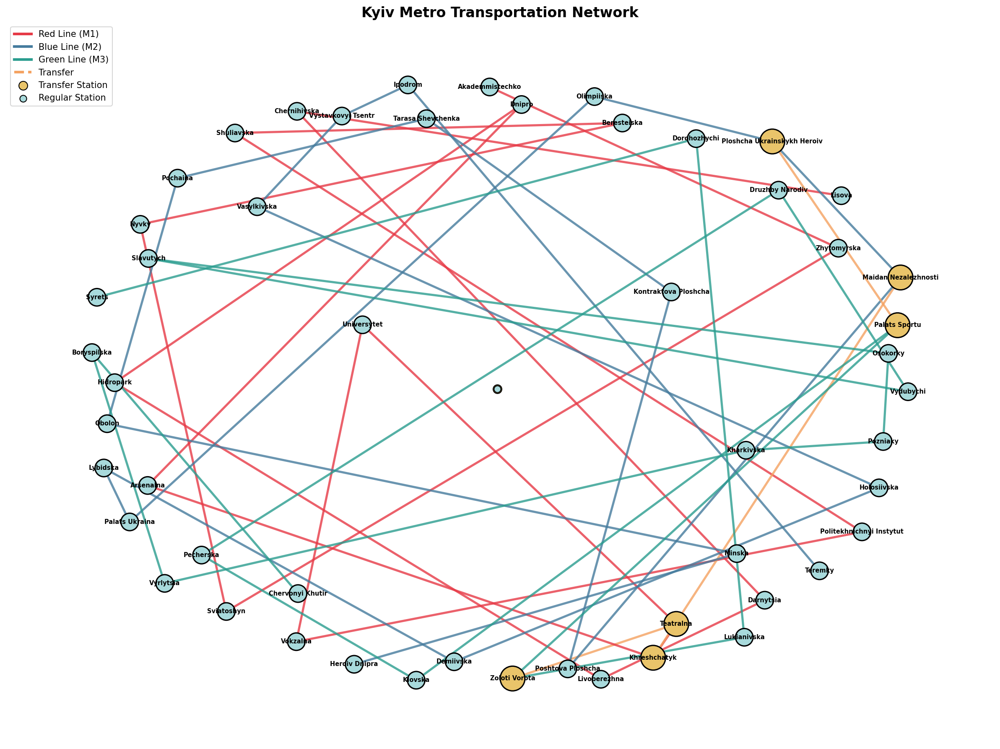

# Домашнє завдання: Графи та алгоритми пошуку

## Завдання 1: Моделювання транспортної мережі

### Опис
Створено граф, що моделює **транспортну мережу Київського метрополітену** з використанням бібліотеки NetworkX.

### Структура мережі
- **Червона лінія (M1)**: 18 станцій (Академмістечко — Лісова)
- **Синя лінія (M2)**: 18 станцій (Героїв Дніпра — Теремки)
- **Зелена лінія (M3)**: 16 станцій (Сирець — Червоний Хутір)
- **Пересадочні вузли**: 3 з'єднання між лініями

### Основні характеристики графа

| Характеристика | Значення |
|----------------|----------|
| Кількість вершин (станцій) | 52 |
| Кількість ребер (з'єднань) | 52 |
| Щільність графа | 0.0392 |
| Зв'язність | Так |
| Діаметр | 22 |
| Середня довжина шляху | 9.03 |

### Аналіз ступенів вершин

| Ступінь | Кількість станцій | Опис |
|---------|-------------------|------|
| 1 | 6 | Кінцеві станції |
| 2 | 40 | Звичайні станції |
| 3 | 6 | Пересадочні станції |

### Пересадочні станції (найвища центральність)

| Станція | Betweenness Centrality |
|---------|----------------------|
| Палац Спорту | 0.4282 |
| Площа Українських Героїв | 0.4220 |
| Майдан Незалежності | 0.3812 |
| Театральна | 0.3718 |
| Хрещатик | 0.3561 |

### Візуалізація



---

## Завдання 2: Порівняння алгоритмів DFS та BFS

### Опис алгоритмів

#### DFS (Пошук в глибину - Depth-First Search)
- Використовує **СТЕК** (LIFO - останній прийшов, перший вийшов)
- Досліджує якомога глибше вздовж кожної гілки перед поверненням
- **Може НЕ знайти найкоротший шлях**
- Ефективний по пам'яті для глибоких графів
- Застосування: розв'язання лабіринтів, топологічне сортування, виявлення циклів

#### BFS (Пошук в ширину - Breadth-First Search)
- Використовує **ЧЕРГУ** (FIFO - перший прийшов, перший вийшов)
- Досліджує всіх сусідів на поточній глибині перед переходом глибше
- **ГАРАНТУЄ найкоротший шлях** у незважених графах
- Використовує більше пам'яті (зберігає всі вузли поточного рівня)
- Застосування: найкоротший шлях, обхід по рівнях, соціальні мережі

### Результати порівняння

| Маршрут | BFS (станцій) | DFS (станцій) | Різниця |
|---------|---------------|---------------|---------|
| Академмістечко → Лісова | 18 | 18 | 0 |
| Героїв Дніпра → Сирець | 14 | 14 | 0 |
| Хрещатик → Золоті Ворота | **3** | 5 | BFS коротший на 2 |
| Академмістечко → Червоний Хутір | **23** | 25 | BFS коротший на 2 |
| Теремки → Осокорки | **17** | 21 | BFS коротший на 4 |

### Детальний аналіз маршрутів

#### Маршрут: Хрещатик → Золоті Ворота

**BFS шлях (3 станції):**
```
Хрещатик → Театральна → Золоті Ворота
```

**DFS шлях (5 станцій):**
```
Хрещатик → Майдан Незалежності → Площа Українських Героїв → Палац Спорту → Золоті Ворота
```

**Пояснення:** BFS знайшов пряму пересадку через Театральну, тоді як DFS пішов через синю лінію до іншої пересадки.

#### Маршрут: Теремки → Осокорки

**BFS шлях (17 станцій):**
```
Теремки → ... → Площа Українських Героїв → Палац Спорту → ... → Осокорки
```

**DFS шлях (21 станція):**
```
Теремки → ... → Площа Українських Героїв → Майдан Незалежності → Хрещатик →
Театральна → Золоті Ворота → Палац Спорту → ... → Осокорки
```

**Пояснення:** DFS зробив зайвий "обхід" через червону лінію замість прямої пересадки на зелену.

### Чому шляхи різні?

1. **Порядок дослідження:**
   - BFS досліджує рівень за рівнем (спочатку всі станції на відстані 1, потім 2 і т.д.)
   - DFS занурюється глибоко в одну гілку перед спробою альтернатив

2. **Оптимальність шляху:**
   - BFS завжди знаходить найкоротший шлях у незважених графах
   - DFS може знайти довший шлях, бо рано фіксується на одному напрямку

3. **Специфіка мережі метро:**
   - Київське метро — лінійна мережа з пересадочними станціями
   - BFS ефективно знаходить шляхи через пересадки, коли це вигідно
   - DFS може пройти всю лінію перед тим, як спробувати пересадку

### Висновки

| Критерій | BFS | DFS |
|----------|-----|-----|
| Найкоротший шлях | ✅ Гарантовано | ❌ Не гарантовано |
| Використання пам'яті | Більше | Менше |
| Швидкість для близьких цілей | Швидше | Повільніше |
| Швидкість для далеких цілей | Однаково | Однаково |

**Рекомендації:**
- Для пошуку найкоротшого маршруту: **використовуйте BFS**
- Для дослідження всіх можливих маршрутів: **використовуйте DFS**
- Для зважених графів (час подорожі): **використовуйте алгоритм Дейкстри**

---

## Завдання 3: Алгоритм Дейкстри

### Опис

Реалізовано алгоритм Дейкстри для пошуку найкоротших шляхів у зваженому графі. До ребер графа додано ваги, що представляють час подорожі між станціями.

### Ваги ребер (час подорожі)

| Тип з'єднання | Час (хв) |
|---------------|----------|
| Між сусідніми станціями | 2.5 - 3.4 |
| Пересадка між лініями | 5.0 |

### Загальна статистика

| Показник | Значення |
|----------|----------|
| Кількість станцій | 52 |
| Кількість пар станцій | 2652 |
| Середній час подорожі | 28.4 хв |
| Мінімальний час | 2.5 хв |
| Максимальний час | 67.4 хв |

### Найдовша та найкоротша подорожі

**Найдовша подорож:**
- Маршрут: Червоний Хутір → Академмістечко
- Час: 67.4 хв
- Кількість станцій: 23

**Найкоротша подорож:**
- Маршрут: Нивки → Берестейська
- Час: 2.5 хв

### Приклади найкоротших шляхів

#### Академмістечко → Лісова
- ⏱️ Час подорожі: **51.0 хв**
- 🚉 Кількість станцій: 18
- 📋 Маршрут: Академмістечко → Житомирська → ... → Театральна (пересадка) → Хрещатик (пересадка) → ... → Лісова

#### Хрещатик → Золоті Ворота
- ⏱️ Час подорожі: **8.3 хв**
- 🚉 Кількість станцій: 3
- 📋 Маршрут: Хрещатик → Театральна (пересадка) → Золоті Ворота

#### Теремки → Сирець
- ⏱️ Час подорожі: **42.9 хв**
- 🚉 Кількість станцій: 15
- 📋 Маршрут: Теремки → ... → Площа Українських Героїв (пересадка) → Палац Спорту (пересадка) → Золоті Ворота (пересадка) → ... → Сирець

### Матриця відстаней (вибрані станції, хв)

|        | Акад | Хрещ | Лісо | ГерД | Терм | Сирц | ЧерХ |
|--------|------|------|------|------|------|------|------|
| Акад   | --   | 30.2 | 51.0 | 56.3 | 64.7 | 40.4 | 67.4 |
| Хрещ   | 30.2 | --   | 20.8 | 26.1 | 34.5 | 16.8 | 43.8 |
| Лісо   | 51.0 | 20.8 | --   | 46.9 | 55.3 | 37.6 | 64.6 |
| ГерД   | 56.3 | 26.1 | 46.9 | --   | 50.6 | 41.3 | 61.7 |
| Терм   | 64.7 | 34.5 | 55.3 | 50.6 | --   | 42.9 | 63.3 |
| Сирц   | 40.4 | 16.8 | 37.6 | 41.3 | 42.9 | --   | 44.0 |
| ЧерХ   | 67.4 | 43.8 | 64.6 | 61.7 | 63.3 | 44.0 | --   |

### Перевірка реалізації

Результати нашої реалізації алгоритму Дейкстри **повністю збігаються** з вбудованою реалізацією NetworkX:

```
Маршрут: Академмістечко → Червоний Хутір
   Наша реалізація:    67.4 хв, 23 станції
   NetworkX:           67.4 хв, 23 станції
   ✅ Результати збігаються!
```

### Алгоритм Дейкстри: Ключові моменти

#### Принцип роботи
1. Ініціалізація: відстань до початкової вершини = 0, до всіх інших = ∞
2. Використання **пріоритетної черги** (бінарної купи) для ефективного вибору вершини з мінімальною відстанню
3. Для кожної вершини перевіряємо всіх сусідів та оновлюємо відстані, якщо знайдено коротший шлях
4. Зберігаємо попередню вершину для відновлення шляху

#### Складність
- **Часова:** O((V + E) log V) з бінарною купою
- **Просторова:** O(V) для зберігання відстаней

#### Переваги над BFS
| Критерій | BFS | Дейкстра |
|----------|-----|----------|
| Тип графа | Незважений | Зважений |
| Оптимізує | Кількість ребер | Суму ваг |
| Застосування | Кількість станцій | Час подорожі |

### Висновки

1. **Алгоритм Дейкстри** знаходить оптимальні шляхи за сумою ваг ребер
2. У контексті метро це дозволяє враховувати **різний час подорожі** між станціями та **час на пересадку**
3. Пересадки (5 хв) значно впливають на вибір оптимального маршруту
4. Центральні станції (Хрещатик, Театральна) забезпечують найшвидший доступ до більшості точок мережі

---

## Запуск програм

```bash
# Завдання 1: Аналіз графа
python3 kyiv_metro_graph.py

# Завдання 2: Порівняння DFS та BFS
python3 dfs_bfs_search.py

# Завдання 3: Алгоритм Дейкстри
python3 dijkstra_shortest_path.py
```

## Файли проекту

- `kyiv_metro_graph.py` — створення та аналіз графа метро
- `dfs_bfs_search.py` — реалізація та порівняння DFS і BFS
- `dijkstra_shortest_path.py` — алгоритм Дейкстри для зваженого графа
- `kyiv_metro_graph.png` — візуалізація графа
- `Task2_Results.md` — документація
